# Flowcharts

Flowcharts are composed of nodes (geometric shapes) and edges (arrows or lines).

## Contents

- Basic Syntax
- Graph Direction
- Node Shapes
- Links/Edges
- Subgraphs
- Special Characters
- Comments
- Styling
- Click Events
- Multiple Nodes Declaration
- Icon Support

## Basic Syntax

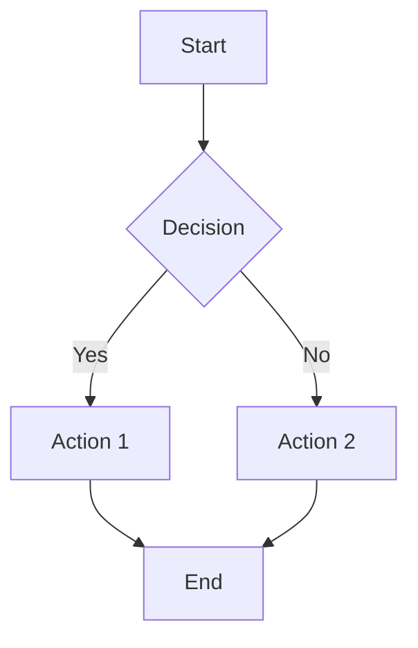

## Graph Direction

- `TB` or `TD` - Top to bottom (default)
- `BT` - Bottom to top
- `LR` - Left to right
- `RL` - Right to left

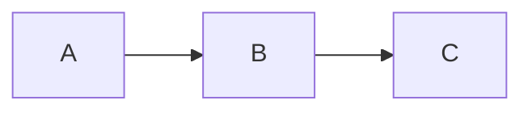

## Node Shapes

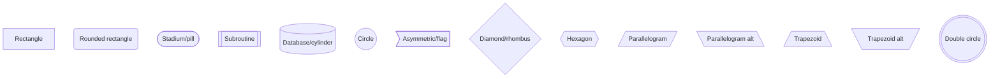

## Links/Edges

### Arrow Types

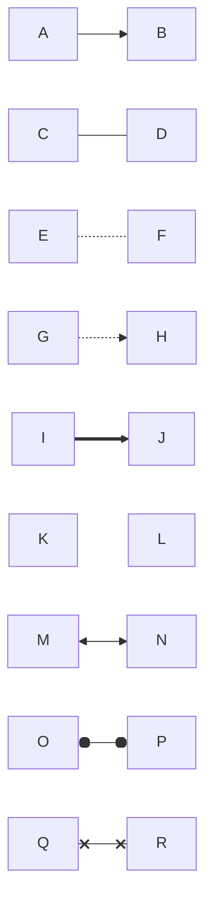

### Link Text

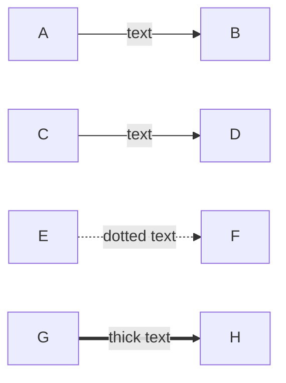

### Link Length

Add extra dashes/dots to make links longer:

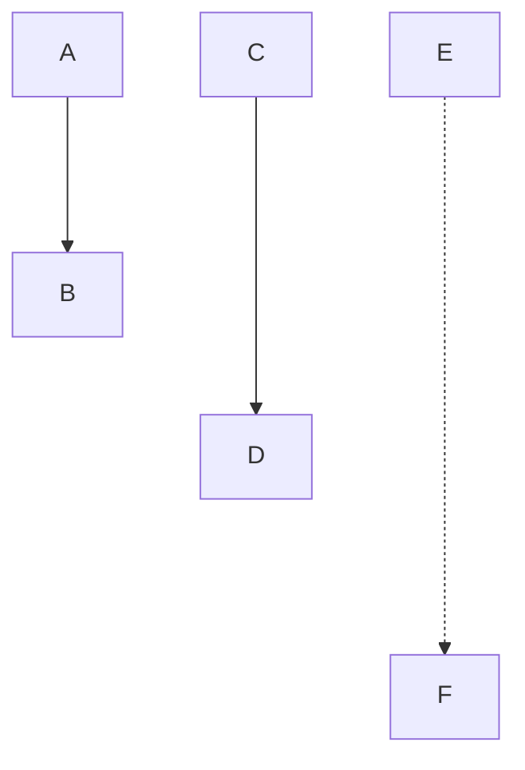

## Subgraphs

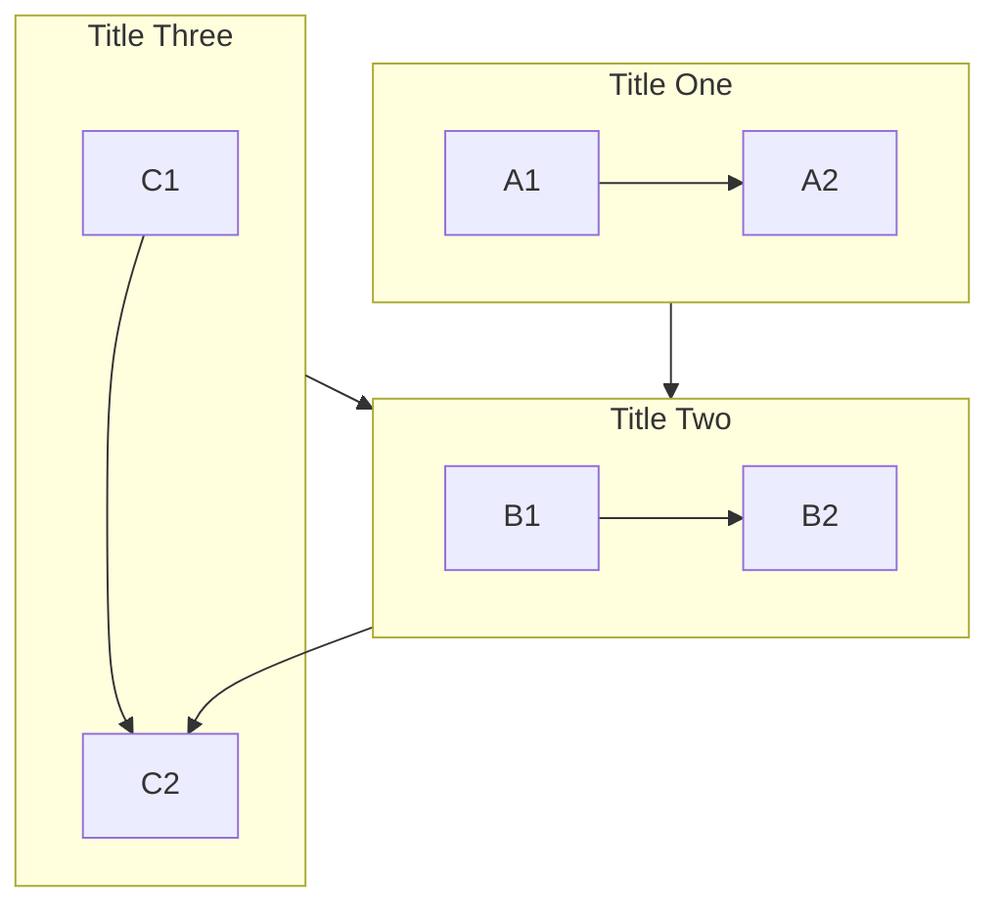

### Subgraph Direction

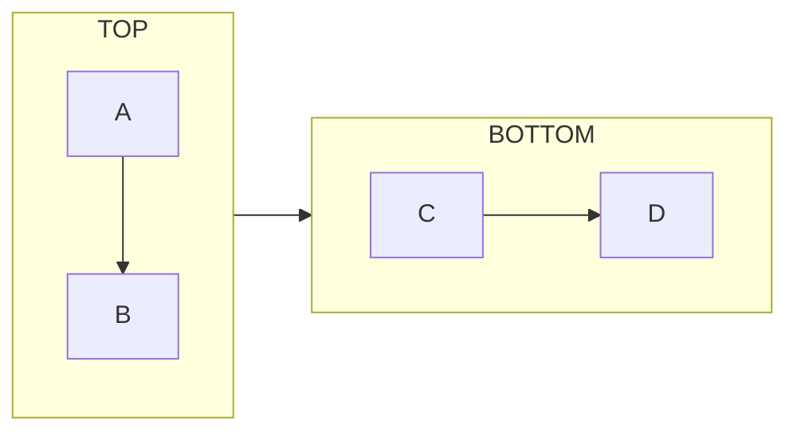

## Special Characters

Use quotes for special characters in node text:

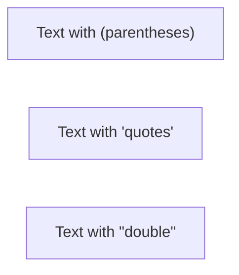

### Entity Codes

- `#quot;` - Double quote
- `#39;` - Single quote
- `#lt;` - Less than
- `#gt;` - Greater than
- `#amp;` - Ampersand

## Comments

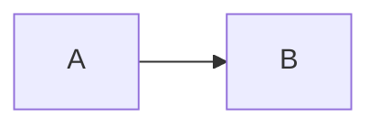

A `%%` comment must sit on its own line. A trailing comment after a statement
(`A --> B %% note`) is a parse error.

## Styling

### Inline Styling

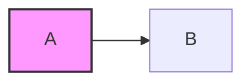

### Style Definitions

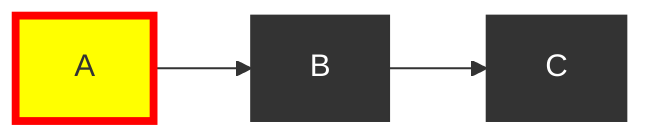

### Link Styling

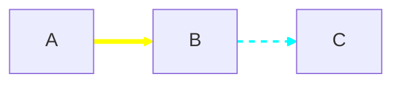

## Click Events

## Multiple Nodes Declaration

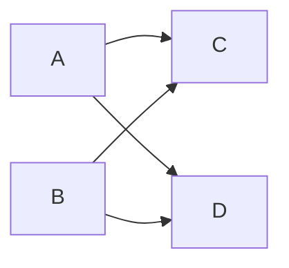

Equivalent to:

## Icon Support

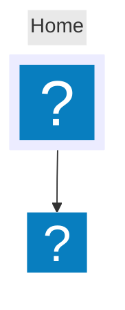

Icon options:

- `icon` - FontAwesome icon (fa:iconname)
- `form` - Shape: square, circle, rounded
- `label` - Text label
- `pos` - Label position: t, b, l, r
- `h` - Height in pixels
