# Mind Maps

Mind maps visualize hierarchical information radiating from a central concept.

## Contents

- Basic Syntax
- Node Shapes
- Hierarchy
- Icons
- Markdown in Nodes
- Complete Examples
- Styling
- Limitations

## Basic Syntax

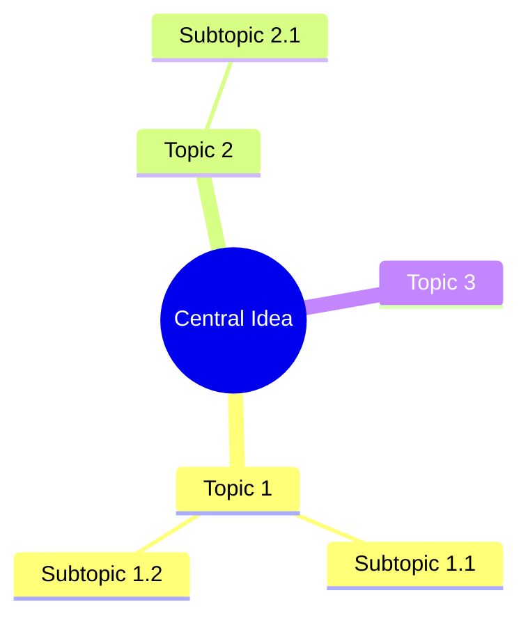

## Node Shapes

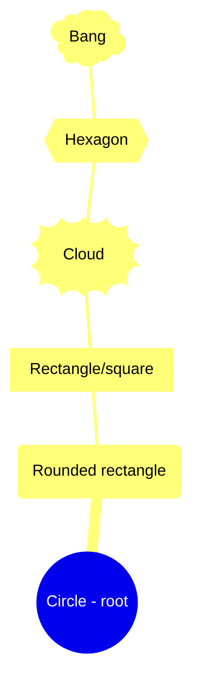

Shape syntax:

- `((text))` - Circle (typically for root)
- `(text)` - Rounded rectangle
- `[text]` - Square/rectangle
- `))text((` - Cloud
- `{{text}}` - Hexagon
- `)text(` - Bang/explosion

## Hierarchy

Indentation defines the hierarchy:

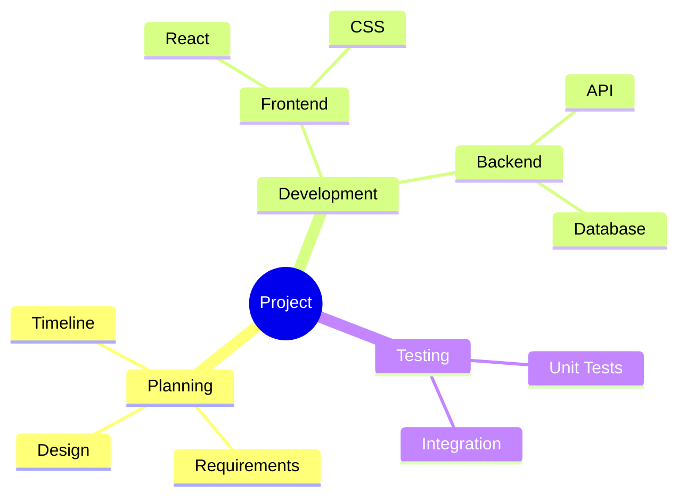

## Icons

Add Font Awesome icons:

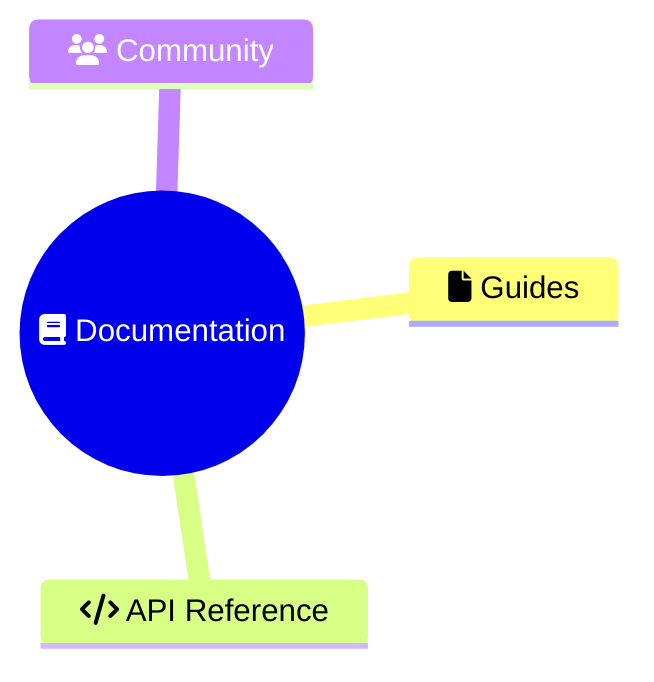

Common icons:

- `fa:fa-home` - Home
- `fa:fa-user` - User
- `fa:fa-cog` - Settings
- `fa:fa-check` - Check
- `fa:fa-star` - Star
- `fa:fa-heart` - Heart
- `fa:fa-folder` - Folder
- `fa:fa-file` - File

## Markdown in Nodes

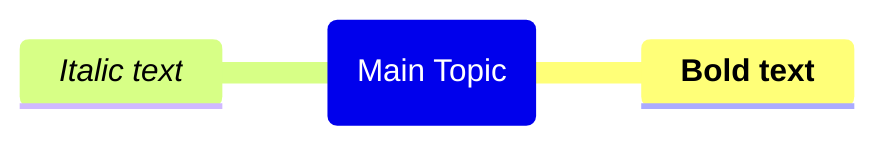

## Complete Examples

### Project Planning

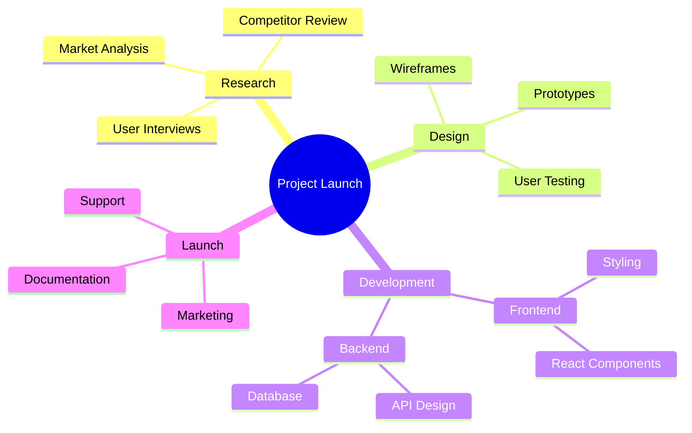

### Learning Path

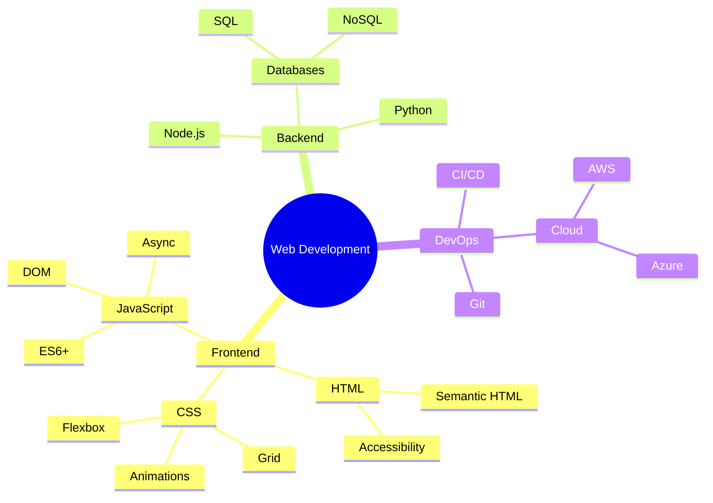

### Meeting Notes

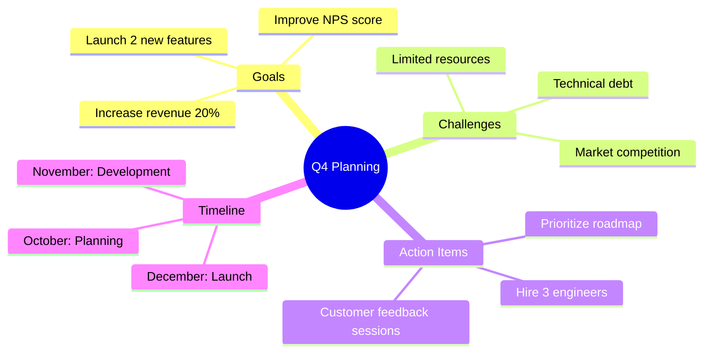

### Problem Solving

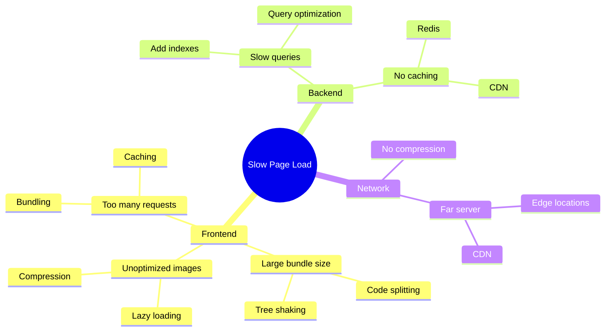

### Decision Tree

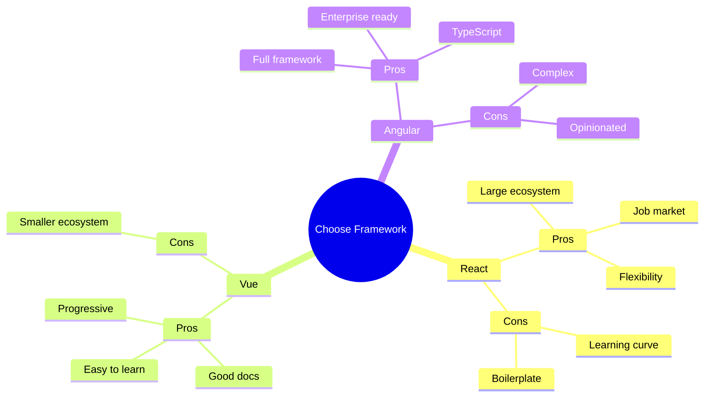

## Styling

### Theme Configuration

Mindmap nodes take their colors from `cScale0`, `cScale1`, and so on, not from
`primaryColor`.

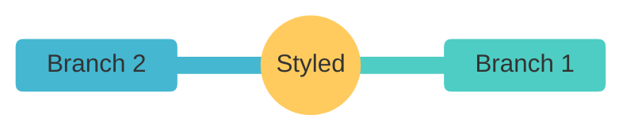

## Limitations

- No custom colors per branch
- Limited styling options
- No connection lines between non-adjacent nodes
- Icons require Font Awesome
- Cannot control layout direction
