# Styling and Configuration

Themes, colors, fonts, and configuration for Mermaid diagrams.

## Contents

- Configuration Methods
- Themes
- Flowchart-Specific Styling
- Sequence Diagram Styling
- Class Diagram Styling
- State Diagram Styling
- Pie Chart Styling
- Git Graph Styling
- Gantt Chart Styling
- Flowchart Configuration
- Font Configuration
- Security Configuration
- Accessibility
- Common Issues

## Configuration Methods

### Frontmatter (default)

Put a YAML block with a `config:` key before the diagram keyword. It must be the
first thing in the diagram. Quote hex colors: an unquoted `#` starts a YAML
comment.

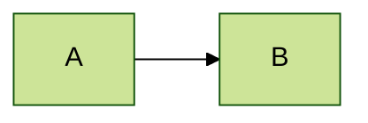

### Init directive (fallback)

Use `%%{init: ...}%%` only when the target renderer bundles a Mermaid release
too old to read frontmatter `config:`. It takes the same keys as JSON, on the
first line of the diagram:


### JavaScript

When you control the page that loads Mermaid, set site-wide defaults:

```javascript
mermaid.initialize({
  theme: 'dark',
  flowchart: {
    curve: 'basis'
  }
});
```

## Themes

### Built-in Themes

Set `theme:` under `config:` to one of:

- `default` - Standard theme
- `dark` - Dark mode
- `forest` - Green tones
- `neutral` - Grayscale
- `base` - Minimal, for customization

### Theme Variables

Customize with `themeVariables`. Only the `base` theme can be modified, so set
`theme: base` alongside them:

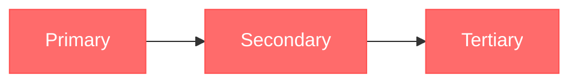

### Common Theme Variables

| Variable              | Description           |
| --------------------- | --------------------- |
| `primaryColor`        | Main node color       |
| `primaryTextColor`    | Text on primary       |
| `primaryBorderColor`  | Primary borders       |
| `secondaryColor`      | Secondary elements    |
| `tertiaryColor`       | Tertiary elements     |
| `lineColor`           | Connection lines      |
| `textColor`           | General text          |
| `mainBkg`             | Background color      |
| `nodeBorder`          | Node borders          |
| `clusterBkg`          | Subgraph background   |
| `clusterBorder`       | Subgraph borders      |
| `titleColor`          | Title text            |
| `edgeLabelBackground` | Edge label background |

## Flowchart-Specific Styling

### Node Classes

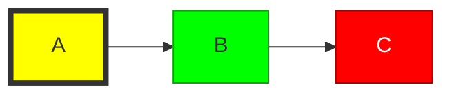

### Default Class

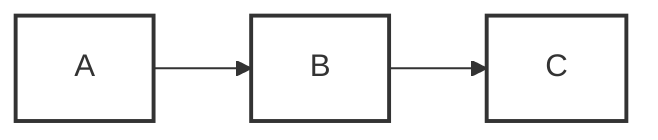

### Apply Classes

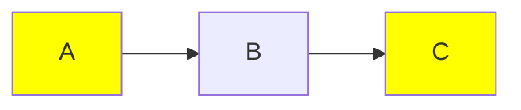

### Link Styling

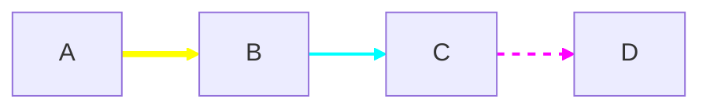

### Link Style Properties

- `stroke` - Line color
- `stroke-width` - Line thickness
- `stroke-dasharray` - Dash pattern (e.g., `5 5`)
- `fill` - Fill color (for arrow heads)

### Subgraph Styling

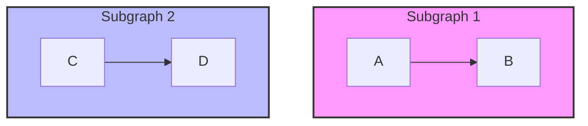

## Sequence Diagram Styling

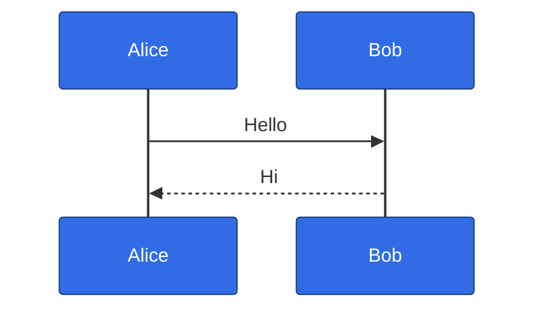

## Class Diagram Styling

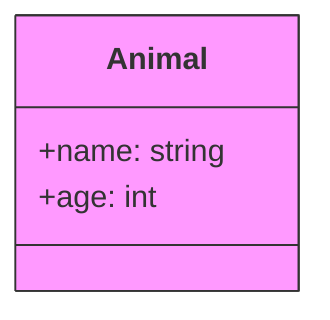

## State Diagram Styling

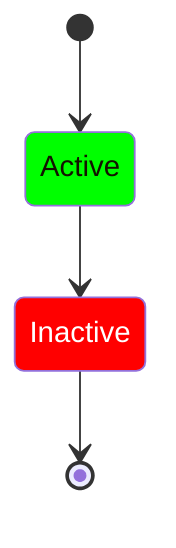

## Pie Chart Styling

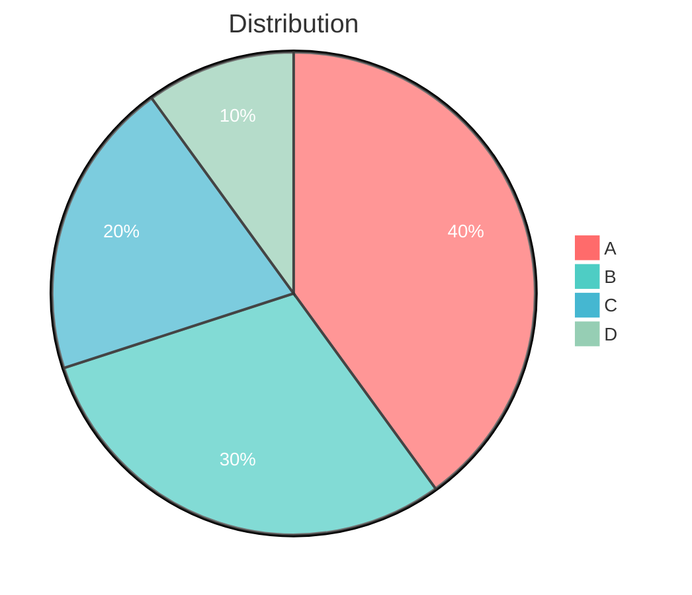

## Git Graph Styling

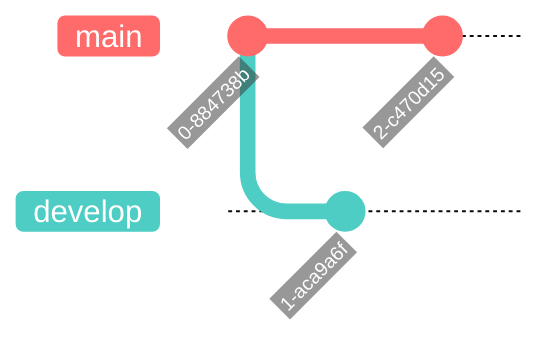

## Gantt Chart Styling

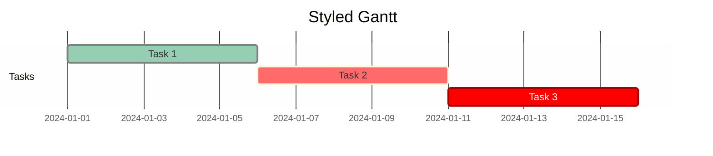

## Flowchart Configuration

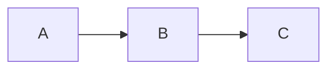

### Curve Options

- `basis` - Smooth curves
- `linear` - Straight lines
- `cardinal` - Cardinal splines
- `monotoneX` - Monotonic in x
- `monotoneY` - Monotonic in y
- `natural` - Natural splines
- `step` - Step function
- `stepAfter` - Step after point
- `stepBefore` - Step before point

## Font Configuration

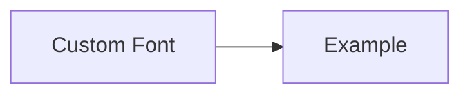

## Security Configuration

```javascript
mermaid.initialize({
  securityLevel: 'strict', // strict, loose, antiscript, sandbox
  startOnLoad: true
});
```

Security levels:

- `strict` - Tags encoded, click disabled
- `loose` - Tags allowed, click enabled
- `antiscript` - Script tags disabled
- `sandbox` - Iframe sandbox mode

## Accessibility

### ARIA Labels

Add descriptions for screen readers:

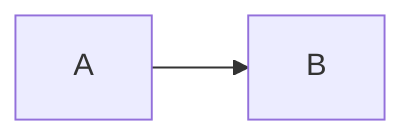

### Title and Description

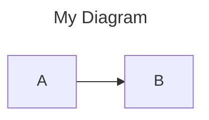

## Common Issues

### Styles Not Applying

- The frontmatter block (or `%%{init: ...}%%` line) must come first, before the
  diagram keyword
- `themeVariables` need `theme: base`
- Quote hex colors in frontmatter; avoid trailing commas in `%%{init}` JSON
- Verify theme variable names are correct

### Colors Not Showing

- Use valid hex colors (`#ff6b6b`)
- Check for typos in variable names
- Some variables require specific diagram types

### Font Issues

- Use web-safe fonts or ensure font is loaded
- Check `fontFamily` is quoted if contains spaces
